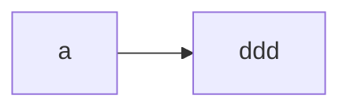

http://playground.tensorflow.org/

http://galaxy.agh.edu.pl/~vlsi/AI/backp_t_en/backprop.html

数学上的卷积是为了令函数光滑

两个3$\times 3$卷积核代替一个$5\times 5$卷积核
先来看一个例子，下图是先后用两个3$\times$3卷积核来处理一个5$\times$5的图片

我们可以发现，两次3$\times$3的卷积覆盖的区域正好是一个5$\times$5的区域，等同于一个5$\times$5的卷积核

