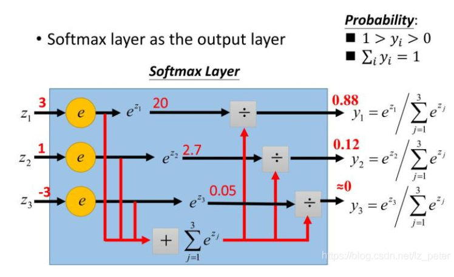

http://playground.tensorflow.org/

http://galaxy.agh.edu.pl/~vlsi/AI/backp_t_en/backprop.html

数学上的卷积是为了令函数光滑

两个3$\times 3$卷积核代替一个$5\times 5$卷积核
先来看一个例子，下图是先后用两个3$\times$3卷积核来处理一个5$\times$5的图片

我们可以发现，两次3$\times$3的卷积覆盖的区域正好是一个5$\times$5的区域，等同于一个5$\times$5的卷积核

### softmax
softmax函数又称归一化指数函数。它是二分类函数sigmoid在多分类上的推广，目的是将多分类的结果以概率的形式展现出来。

概率有两种性质:
- 1.预测的概率为非负数
因为指数函数的值域取值范围为$[0,\infin]$，所以可以将模型的预测结果映射到指数函数上，保证了概率的非负性
- 2.各种预测的结果概率之和等于
为了保证各个概率的和为1，需要将转换后的结果进行归一化处理---就是将每次转化后的结果除以所有结果的和。

