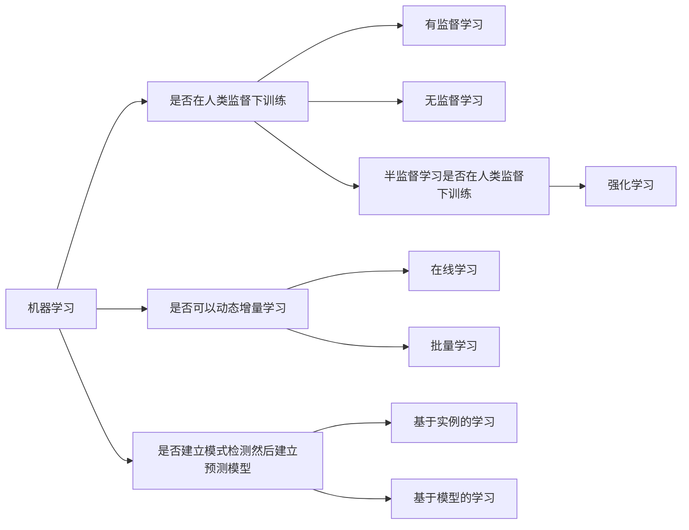

# 机器学习的基础知识
## 什么是机器学习
Tom Mitchel定义为一个计算机程序利用经验E来学习任务T，性能是P，如果针对任务T的性能随着经验E不断增长，则称为机器学习

系统用来学习的样例称为训练集，每个训练样例称为训练实例(或样本)。

如果只是下载了一份wiki的副本，并不是机器学习，只有单纯的数据经验并没有进行学习任务。

## 为什么使用机器学习
机器学习相比传统算法可以从数据中自动学习新的规则

另一个亮点是可以处理对于传统方法而言太复杂或者没有已知算法的问题。

使用机器学习方法挖掘大量数据来帮助发现不太明显的规律，这成为数据挖掘。

总结一下，机器学习适用于：
1.对于有解决方案的问题，比传统算法更好地性能
2.传统方法难以解决的问题，机器学习或许可以解决
3.环境有波动，机器学习可以适应新数据
4.对大量数据的环境可以适应

## 机器学习系统的类型

### 监督学习与无监督学习
根据训练期间接受的监督数量和监督类型，可以将机器学习系统分 为以下四个主要类别：有监督学习、无监督学习、半监督学习和强化学习

在有监督学习中，提供给算法的包含所需解决方案的训练集称为标签

严格得来讲，属性只是一种数据类型，即为key，而特征是属性加上其值，即为key=value

无监督学习是训练集没有加上标签

特征提取是指将多个特征进行简化，不丢失太多信息的情况下，简化数据。

==较好的做法是先进性特征提取，再将简化后的数据提供给算法进行执行==

### 半监督学习

由于通常需要给数据做标记非常耗时与昂贵，所以往往有很多未标记的数据而很少有已标记的数据，这些算法
称为半监督学习。

大多数无监督学习算法是无监督学习与有监督学习算法的结合

### 强化学习
则是一个与众不同的巨兽，他的学习系统能够观察环境，做出选择，执行动作，获得回报或者惩罚。

### 批量学习与在线学习
#### 批量学习
在批量学习中，系统无法进行增量学习--即必须使用所有可用数据进行训练，这需要大量时间和计算资源，所以通常是离线完成的。离线学习就是先训练系统，然后将其投入生产环境，这时学习过程停止，它只是将其所学到的应用出来。

如果希望批量学习新数据，需要完整数据集基础上重新训练系统的新版本，然后停用旧系统，用新系统取代。所幸整个训练、评估、启动机器学习可以轻易实现。

这个方案比较简单，但是每次都需要使用完整数据集进行训练，需要耗费大量时间与计算资源以及金钱。

所以我们使用一个更好地选择

#### 在线学习
在在线学习中，可以循环渐进地给系统提供训练数据，逐步积累学习成果。这种提供数据的方式可以是单独的，也可以采用小批量的小组数据来进行训练，每一步学习都非常快速且便宜，这样系统就可以根据飞速写入的最新数据进行学习。

对于这类系统需要接收持续的数据流，同时对数据流的变化作出快速或者自主的反应。

对于计算资源有限的情况，这种方式无疑十分适用，而且它也可以处理大量数据。

核外学习通常是离线完成的，因此在线学习容易让人产生误解，我们可以将其视为增量学习。

在线学习系统的一个重要参数是其适应不断变化的数据的速度，就是所谓的学习率。

在线学习面临的一个重大挑战是：如果给系统输入不良信息，系统的性能会逐渐下降。

### 基于实例的学习与基于模型的学习
另一个对机器学习系统进行分类的方法时看他们如何进行泛化，大多数机器学习任务是做出预测，意味着需要通过给定示例，在此前未见得到示例上进行预测，在训练数据上表现的性能固然重要，但更重要的是要在新对象实例上表现出色。

泛化的两种主要方法：基于实例的学习与基于模型的学习
#### 基于实例的学习
系统用心学习实例，通过使用相似度度量来比较新实例与已经学习的实例，从而泛化新实例。

#### 基于模型的学习
从一组实例集中实现泛化的另一种方法时构建的模型，然后使用该模型来进行预测。

怎样才能知道什么值可以使模型表现最佳：
定义一个效用函数衡量模型有多么好

或者一个成本函数来衡量模型有多么差

模型选择包括选择模型的类型与完全指定它的架构，训练一个模型意味着运行一种寻找模型参数的算法，使其最适合训练数据

回归这个奇怪的名字是Francis Galton在研究高个子孩子比父母矮的事实时引入的统计术语。该术语后来被他应用于分析变量之间相关性的方法

## 机器学习面临的主要挑战
简单来说，我们的任务就是选择一种算法，对某些数据进行训练，所以最可能出现的问题不外乎就是"坏算法"与"坏数据"
### 训练数据的数量不足
2001年，Michel Banko与Eric Bril表明，只要给足够的数据，截然不同的算法在自然语义歧义消除这个问题上，表现几乎一致。 

也许，对复杂算法而言，数据比算法更重要。

但是中小型数据相当普遍，获得额外的数据并非易事。

### 训练数据不具有代表性
为了很好地泛化，至关重要的一点是训练数据一定要有代表性。

使用不具有代表的数据训练出来的模型不可能做出准确的评估。

但是采样具有代表性并不容易，样本集太小会出现采样噪声，若样本数据非常大，也可能由于采样方式欠妥而导致非代表性数据集。

无反应偏差：采样中一些关键群体被排除

### 低质量数据
如果训练集满是错误、异常值和噪声（例如，低质量的测量 产生的数据），系统将更难检测到底层模式，更不太可能表现良好。所 以花时间来清理训练数据是非常值得的投入

### 无关特征

### 过拟合数据

标注工具
[labelimg](https://github.com/heartexlabs/labelImg)
[Netron](https://github.com/lutzroeder/netron)

(math.mit.edu)/

cbovar

visual DL

plotnerualnet

imagenet 李飞飞