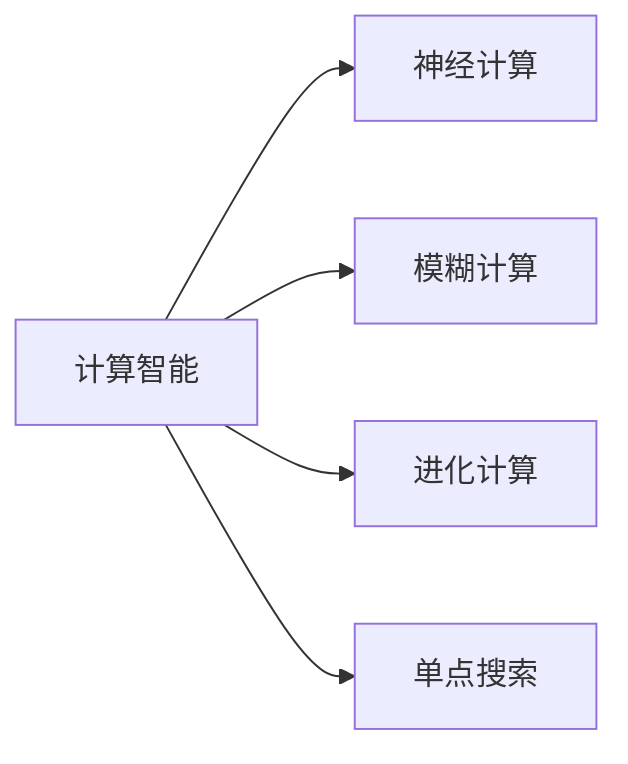

计算智能是受到大自然的启发而设计出的一类算法的统称。

采用传统的计算方法在现代生产中会遇到计算复杂度高的问题，特别是一些NP难的问题(Non-DETERMINISTIC pOLTNIMIAL)，传统算法无法忍受如此之长的时间。

这些具有启发式特征的计算智能算法共同组成了计算智能优化算法。

# 绪论

## 最优化问题
最优化问题(Optimization Problem)求解一个可行的甚至是最优的方案的决策问题

公式为:
$minf(x),x\in D$
其中D为解空间，X为D中的一个合法解，==最优化问题就是在解空间中寻找一个合法的解X(即为一组最佳的决策变量),使得X对应的函数映射值最小或者最大==

根据决策变量x_i的取值类型，可以分为==函数优化问题==和==组合优化问题==

- 函数优化问题：
  - 决策变量均为连续变量的最优化问题为函数优化问题

- 组合优化问题
    - 若一个最优化问题的全部决策变量均为离散取值，则称为组合优化问题

也有许多应用问题的数学模型表现为混合类型，即一部分决策变量为连续型，一部分表现为离散型。

根据最优化问题中的变量等情况，最优化问题可以分为多种类型:

### 函数优化问题
由于决策变量是连续值，因此对每个变量进行枚举是不可能的所以必须借助最优化方法来进行求解。

### 组合优化问题
组合优化问题的决策变量是离散取值的，典型的有旅行商问题和0-1背包问题。

- 旅行商问题(Symmetrical TSP,stsp)
设有n个城市，任意两个城市之间的距离如矩阵 $D = (d;j)_{n\times n}(i ,j = 1, 2, ... ， n)$所示，其中 $d_{ij}$, 表示从城市i到城市j的距离。旅行商问题就是需要寻找这样的 一 种周游方案 ： 周游路线从某个城市开始， 经 过 每 个城市 一 次且仅 一 次，最终回到出发城市 ， 使得周游的路线总长度最短 。 数学 化 之后就是求解如公式所示的 一 个最小值问题。

$f=min \sum_{i=1}^n d_{\pi(i)\pi(i+1)}\\其中\pi(i)表示周游序列中第i个城市的编号，而且有\pi(n+1)=\pi(1)$
一般的旅行商问题称为对称旅行商问题，因为$d_{ij}=d_{ji}$,若两者不相等，则为非对称旅行商问题

- 0-1背包问题(Zero/One Knapasack Problem,ZKP/0-1KP/KP)
在给定装载量为c的背包、n个重量与价值分别为$w_i$、$v_i(1\leq i\leq n)$的物品，在不超过装载量的条件下，使得装载的物品的总价值最大。

    公式为：
    $max ~~z= \sum_{i=1}^nv_ix_i\\s.t.~~\sum_{i=1}^nw_ix_i\leq c,\\其中$x_i\in\{0,1\}$且满足限制条件\\x_i表示是否装载这个物品$

==对于对称TSP问题与0-1背包问题，通过枚举方法可以得到分别$(n-1)!与2^n$个解==，当n比较大时，它们都是非常大的解空间，因此枚举的方法只能处理一些小规模的组合优化问题，对于大规模问题我们可以借助智能优化计算方法来在合理的结果内求解得到令人满意的解。

### NP理论
为了简化问题，我们只考虑一种问题——判定性问题，即提出一个问题，只需要回答“是”或者“否”的问题，==任何一般最优化问题都可以转化为一系列判定问题==

#### P类问题(Polynomical Problem)
P类问题是指一类可以用==确定性算法==来==在多项式时间内==求解的判定问题，在非正式的定义中，可以将那些在多项式时间内求解的问题称为P类问题。

#### NP类问题
##### 为了定义NP问题，首先需要引入不确定性算法(Non-deterministic Algorithm)
包括两个阶段
eg：将一个判定问题的实例l作为输入，进行如下的两步操作：
- ==非确定(猜测)阶段==：生产一个任意串S，把它当作给定实例l的一个候选解
- ==确定(验证)阶段==：确定算法将l和S作为输入，若S为l的一个解，则输出“是”

    如果一个不确定算法==在验证阶段的时间复杂度是多项式级别的==，我们称为==不确定性多项式算法==

**NP类问题(Non-deterministic Polynomial Problem)**
NP类问题是指一类可以用==不确定性多项式算法==求解得判定问题。

以TSP问题为例：
虽然还不能找到一个多项式的确定算法来求解最小的周游路线，但是可以在一个多项式时间内对任意生成的一条路线判定是否合法(经过每个城市一次且仅一次)

比较P类问题和NP类问题，我们可以得到一个结论：$P\subseteq NP$但是，P=NP是否成立至今仍是一个未解之谜,但是由于TSP这样的问题存在，人们更倾向于相信P是不等于NP的

#### NP完全问题(NP Complete Problem)
一个判定问题D是NP完全问题的条件是：
- 1.D属于NP类
- 2.NP中的任何问题都能够在多项式时间内转化为D

一个满足2但不满足1的问题称为NP难问题，也就是说，==NP难问题不一定是NP类问题，NP难问题至少和NP完全问题一样难==

三者关系图展示

### 智能优化计算方法：计算智能算法

随着技术的进步，工程实践问题变得越来越复杂，传统的计算方法面临着计算复杂度高、计算时间长等问题，特别是对于一些 NP 难和 NP 完全问题，设计用于求解这些问题的精确算法往往由于其指数级的计算复杂性而令人无法接受 。

因此，为了在求解时间与求解精度上取得平衡，计算机科学家提出了具有启发式特征的计算方法。

这些受大自然智慧启发的方法，希望通过模拟大自然和人类的智慧实现对问题的优化求解，在可接受的时间内求解得到可接受的解，称为计算智能(Computational Intelligence,CI)算法

计算智能属于人工智能的一个分支，形成了逻辑主义、行为主义、联结主义三大学派。

本书重点介绍联结主义，也就是所谓的智能优化计算方法或者称为计算智能算法

#### 计算智能的分类与理论
计算智能算法包括神经计算、模糊计算、进化计算三大部分

这些算法有一个共同的特征，那就是通过模仿人类智能的某一个方面达到模拟人类智能。

==但是，计算智能的发展缺乏坚实的数学基础==

计算智能算法的主要特征:
- 智能性
包括算法的自适应性，自组织性，算法不依赖于问题本身的特点，具有通用性
- 并行性
算法基本上是以群体协作的方式对问题进行优化求解，适合大规模并行处理
- 健壮性
- 算法具有很好容错性

## 遗传算法(Genetic Algorithm,GA)
### 基本原理
由美国密歇根大学的John H.Holland提出的一种自适应的全局搜索算法。

达尔文的进化理论与孟德尔的遗传学说为基础的现代遗传学对算法的提出具有重要的影响。

遗传算法通过模拟自然界中生物的遗传进化过程，对优化过程的最优解进行搜索。
对于群体的进化，==引入了类似自然进化中选择、交配、变异等算子==。遗传算法搜索全局最优解的过程是一个不断迭代的过程，(==每一次迭代相当于生物进化中的一次循环==)

在遗传算法中，问题的==每一个有效解称为"染色体"(chromosome)==,也称为"串",相对于群体中的每个生物个体(individual)。
==染色体的具体形式是一个用特定编码方式生成的编码串==。
传中的每一个编码单元称为"==基因=="

- ==适应值(fitness value)==
用于区分染色体的优劣，适应值越大的染色体越优秀
- ==评估函数(evalution function)==
计算并确定染色体对应的适应值
- ==选择算子(selection)==
按照一定规则对群体的染色体进行选择，得到父代种群，越优秀的染色体被选中的次数越多
- ==交配算子(crossover)==
作用于两个成功交配的染色体，染色体交换部分基因，产生两个子代染色体，子代染色体取代父代进入种群，没有交配的染色体直接进入新种群
- ==变异算子(mutation)==
使新种群发生小概率的变异，得到新的染色体，变异后的新种群替代原有群体进入下一次进化

Holland提出了==模式定理(Schema Theory)== 
==模式==(schema)是指群体中编码的某些位置具有相似结构的染色体集合，==模式中具有确定取值的基因个数==叫做==模式的阶(schema order)==
- eg:
假设染色体的编码是由0或1组成的二进制符号序列，模式O1·X··X··X·O则表示以01开头且以0结尾的编码串对应的染色体的集合，即 { 010000 , 010010, 010100 , 010110 , 011000 , 011010 , 011100,011110}

==模式的定义长度==为(Schema defining length)是指模式中第一个具有确定取值的基因到最后一个具有确定取值的基因的距离。

- eg:
例如模式 01***0 的定义长度为5, 而 \*1\****的定义长度为0。

Holland的模式定理提出，==遗传算法的实质是通过选择、交配和变异算子对模式进行搜索，低阶、定义长度较小且平均适应值高于群体平均适应值的模式在群体中的比例将呈指数级增长==，即随着进化的不断进行，较优的染色体个数将快速增加。

模式定理虽然证明了遗传算法能找到全局最优解的可能性，但是不能保证算法一定能找到全局最优解。

Goldberg在1989年提出了==积木块假设(BUliding Blick Hypothesis)==,对模式定理做了补充，说明遗传算法具有找到全局最优解的能力。

积木块：指==低阶、定义长度较小且平均适应值高于群体平均适应值的模式==，积木块假设认为在遗传算法的运行过程中，==积木块在遗传算子的影响下能用产生结合，产生新的更加优秀的积木块==，最终接近全局最优解。

但是目前还不能为积木块假设是否成立提供一个严整的论断与证明。

### 遗传算法的流程
遗传算法的实现主要包括以下七个重要问题:
- 染色体的编码
- 群体的初始化
- 适应值评价
- 选择种群
- 种群交配
- 种群变异
- 算法流程

### 染色体编码
染色体的编码方式:==应用遗传算法，需要解决问题解的表示==

染色体编码方式是否得当会对接下来染色体的交配与变异操作构成影响。

我们希望找到一种既简单又不影响算法性能的编码方式，但是目前并没有一种统一原则。

常用的方法有格雷码编码、字母编码、多参数交叉编码等。

- ==二进制编码方法(Binary Represstation)==
利用这种编码方式产生的染色体是一个二进制符号序列，染色体的每一个基因智能取值0/1，假定问题有效解的取值空间为$[U_{min},U_{max}]^D$，D为维数，

由于精度为$\frac{U_{max}-U_{min}}{2^L-1}$
当需要增加精度时，需要增大L,但是L变得很大时，将急剧增加算法造作的复杂度

- ==浮点数编码方法(Float Point Repressntation)==
