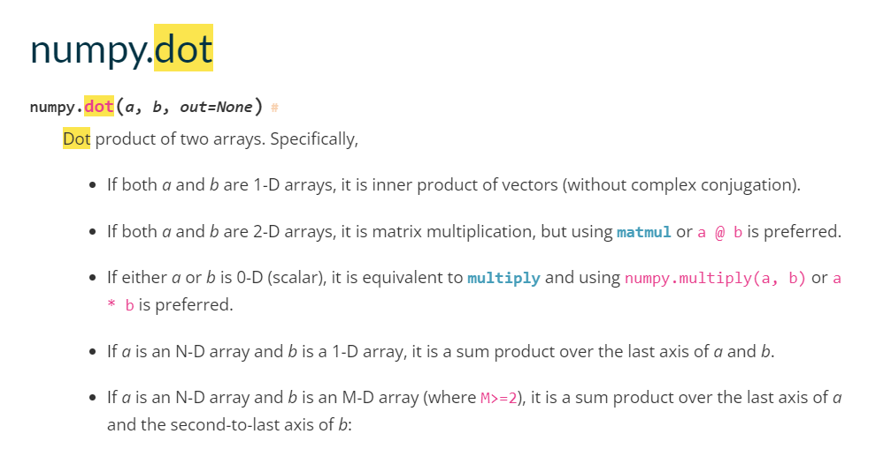

## 数学函数
np.sqrt()
np.square

## 创建数组函数
np.full:以指定的填充值填充指定格式的数组

## ndarray索引

### 一维情况
一维索引创建的切片是原数组的==视图==，对切片的修改会反映在原数组上，如果要创建切片的副本，要使用ndarray.copy()函数
==其原因是如果创建一个切片就对原数组进行一次复制，会大大增大内存负担==
#### 示例如下：
```python
arr=np.arange(5)
print(arr)
arr1=arr[3:]
arr1[0]=2
print(arr1)
print(arr)
>>
[0 1 2 3 4]
[2 4]
[0 1 2 2 4]
```
**使用ndarray.copy()后**
```python
arr2 = arr[3:].copy()
print(arr2)
arr2[0] = 11
print(arr2)
print(arr)
>>
[2 4]
[11  4]
[0 1 2 2 4]
```
### 二维情况
1.单个索引值:取行号
```python
num_list = [[1,2,3],[4,5,6],[7,8,9]]
arr = np.array(num_list)
arr[0]
>>
array([1, 2, 3])
```

2.迭代索引:先取行号，再取行中的列号
```python
print(arr)
print(arr[0][0])
>>
[[1 2 3]
 [4 5 6]
 [7 8 9]]
1
```
3.按行按列索引:取二维数组中指定的行号范围和列号范围的部分
**形式解释**:
[左侧为行范围 , 右侧为列范围]
```python
print(arr)
>>
[[1 2 3]
 [4 5 6]
 [7 8 9]]
```
**表示取第0行**
```python
print(arr[0])
>>
[1 2 3]
```
**表示取第0行到第1行，此处没有","所以只有行索引**
```python
print(arr[0:2])
>>
[[1 2 3]
 [4 5 6]]
```
**表示取第0行，","左侧表示取第0行，右侧没有圈定列范围，即为所有的列**
```python
print(arr[0,])
>>
[1 2 3]
```
**此处","左侧为第0行，右侧没有圈定列范围，即为所有的列，只是":"写出来了**
```python
print(arr[0,:])
>>
[1 2 3]
```
**此处","左侧表示取第0行至第1行，右侧表示取第0列至第1列**
```python
print(arr[0:2,0:2])
>>
[[1 2]
 [4 5]]
```
**此处","左侧表示取第0行，右侧表示取第1列，相当于取位置为(0,1)处的元素**
```python
print(arr[0:1,1:2])
>>
[[2]]
```
**此处","左侧表示取第0行，右侧表示取第0列,相当于取位置为(0,0)处的元素**
==但是值得注意的是，这里返回的是单个元素，type为int,而上面返回的是一个二维数组，区别在于上面使用了行切片与列切片==
```python
print(arr[0,0])
>>
1
```
**此处","左侧表示取所有行，右侧表示取第0列至第1列**
```python
print(arr[:,:2])
>>
[[1 2]
 [4 5]
 [7 8]]
```

## np.dot()与np.outer()
np.dot()对于一维向量来说就是计算两个一维向量的内积
对于多维向量也就是矩阵来说也就是计算两个矩阵的乘法

而np.outer()其实就是专门计算外积的函数，对于一维向量，它计算两个向量的外积，对于两个多维向量，它会将两个向量展为一维向量来计算

其实，所谓内积与外积只是针对一维向量来说的，在矩阵中只有正常的矩阵乘法或是对应元素相乘这两种形式




## np.squeeze()
这个函数是用作压缩维度的，输入参数为：
a ：array_like ，Input data.
axis：None or int or tuple of ints, optional
第一个参数a是输入的数据应当为一个数组，第二个参数是要可选的，可以指定压缩的维度具体是哪一个，如果不选，就默认选择所有符合要求的维度

note：压缩维度只能压缩那些长度为1的，也就是只有一个元素的维度