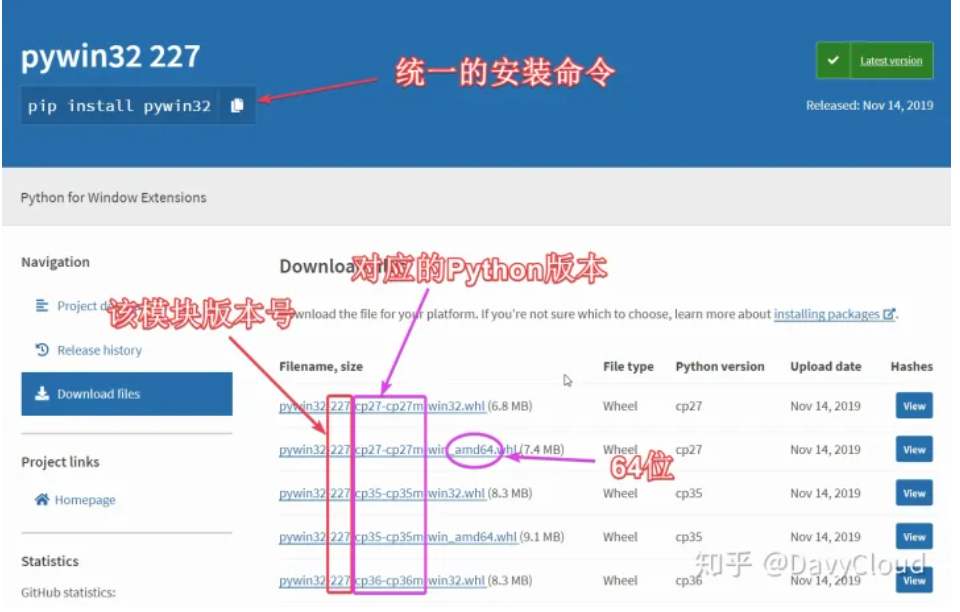
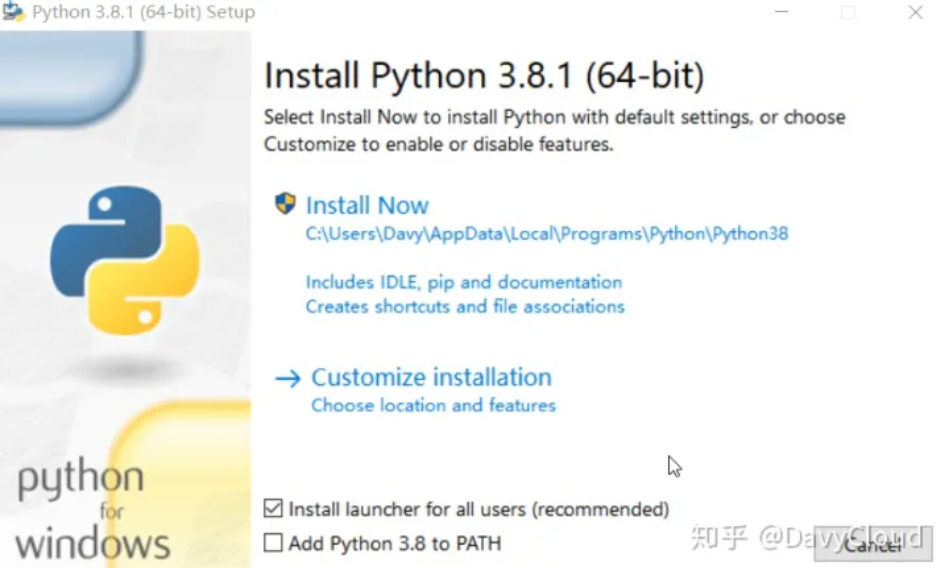
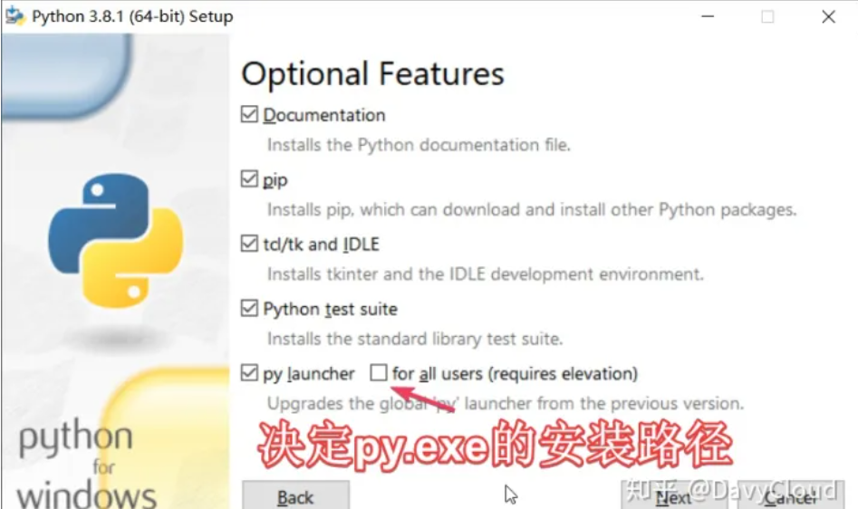
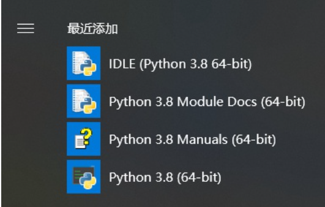
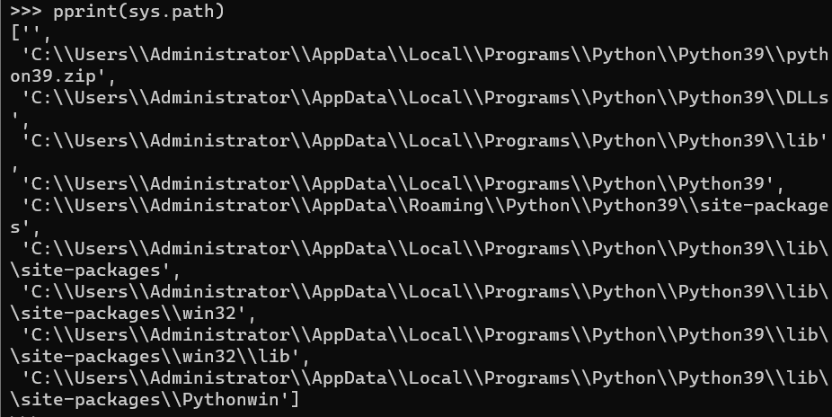
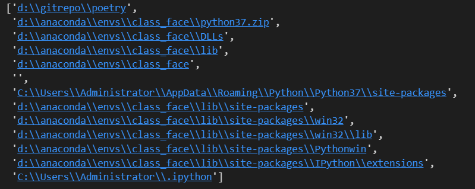
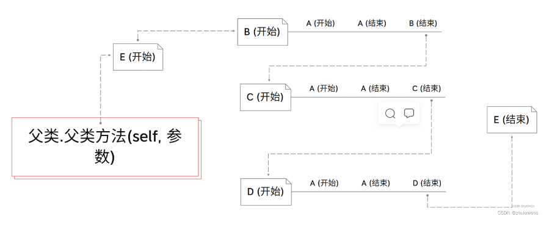
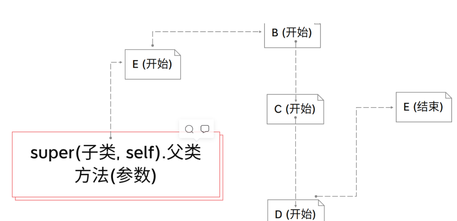

## Python 杂记
### Python的安装
#### 对版本号的解释

### 为什么更推荐安装launcher而不推荐添加到环境变量

在本地安装多个Python版本后，如果它们的安装目录不同，它们不会起冲突，但是只有一个版本可以添加到环境变量中，在linux中，可以很方便地被解决。

但是在windows中，就很不方便了，于是有了Python启动器(launcher)。<mark>它可以方便地管理所有安装过的Python版本，轻松启动不同版本的Python解释器，不管有没有加入到PATH中</mark>
### 自定义安装的一些选项解释

- Documentation:离线的 .chm 格式文档
- pip Python 包下载工具，必须保留。
- tcl/tk and IDLE
- Python test suite
- py launcher
### 对安装的目录的解释
- DLLs(Dynamic Link Librarys)
:动态链接库，内部是一些.dll文件和.pyd文件
- doc:内部是pythonxxx.chm,也就是文档
- include:头文件
- Lib:最重要的目录，几乎所有标准库源码都在这里，其中<mark>site-packages</mark>后续安装的第三方模块和包都在这里
- libs:
- scripts:可执行文件的 位置
- tcl
- tools：自带的一些Python脚本

### 启动菜单后

- IDLE (Python 3.8 64-bit)，用来启动 IDLE ，以后再详细介绍它。
- Python 3.8 Module Docs (64-bit)，点击会自动启动一个本地 web 服务，然后自动打开包含模块文档的网页，样式非常古老，而且其中的内容都包含在下面的文档文件中了，所以基本没人会用这个。
- Python 3.8 Manuals (64-bit)，点击打开文档
- Python 3.8 (64-bit)，点击用来启动 Python 解释器。用这种方法启动解释器，退出后就整个黑窗口都消失了，打印的信息也都看不到了，所以我们一般是先启动命令行，再从命令行内启动 Python，这样即使解释器退出了，也能看到刚才程序执行的结果。

### precompile standard library 预编译标准库

### 环境
环境，就是Python代码的运行环境，应该包含:
- Python解释器
    用哪个解释器来执行代码，就是Python.exe
- Python库的位置
    去哪里import所需的模块，就是Lib
- 可执行程序的位置，就是Scripts

Lib和site-package是绝大多数包的所在，但是准确的来说，包的搜寻路径是由"sys.path"决定的。

比如在本地环境下：

在anaconda的一个虚拟环境下:

其中,""表示当前路径

### super类
super(子类,self)
使用super和直接继承的区别:可以防止多次初始化父类

父类.父类方法(self,参数)

super(子类,self).父类方法(参数)
