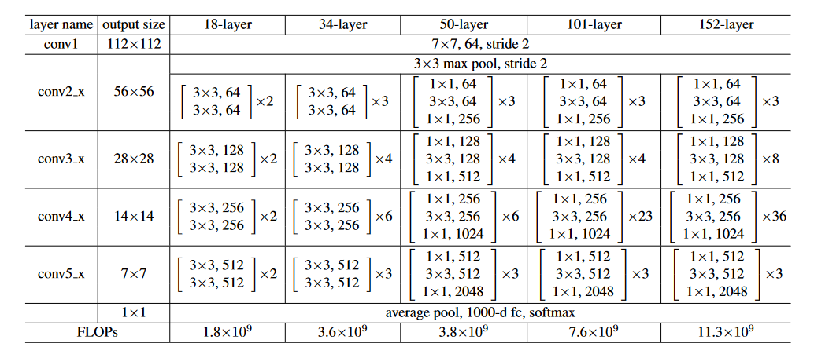
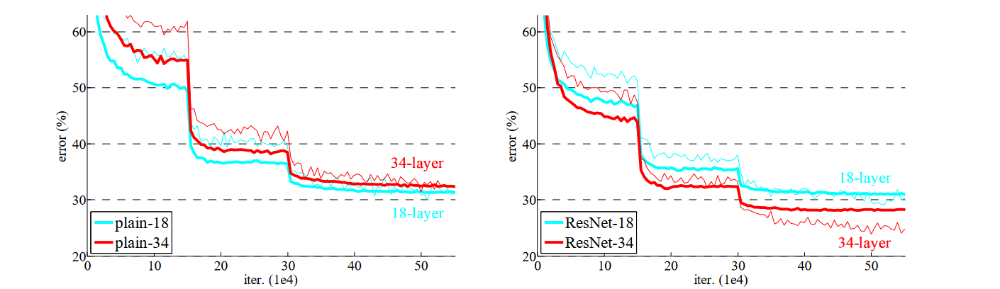
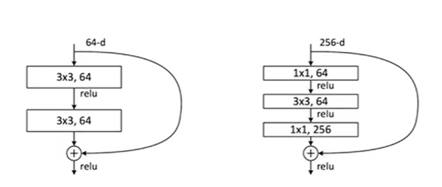

训练很深的网络是一件很难的事情

 神经网络做的很深就一定很好吗?

 然而并不是，随着层数的增加，有可能出现梯度消失或者梯度爆炸的问题。

 一个比较好的解决方案是可以在一开始进行标准化，随机初始化时权重不要太大或太小

 随着深层网络开始收敛时，一个问题出现了：当网络越来越深的时候，错误率反而增高了，然而这并不是因为过拟合导致的。

 因为训练误差与测试误差都变大了，过拟合是训练误差变小，测试误差变大。

 一篇文章不一定非要提出一个原创的算法或者思想，也可以将前人提出的东西结合起来有效地解决现存的问题。

 在这里为什么每个残差块的个数是如表一中所示的，这里并没有给出明确的原因，因为这是作者调出来的超参数。

 

 FLOPs:整个网络需要多少浮点运算

 

 这幅图中，突然性地跳跃产生的原因是改变了学习率的效果。

 当输入与输出不一样时，可以填充0或者做投影

当ResNet变得越来越深的时候，引入一个瓶颈的设计，增加通道数，并且做了巧妙地设计没有增加算法复杂度。

ResNet本质上其实是对SGD(随机梯度下降法)的一种优化

$\frac{\partial{f(g(x))}}{\partial{x}}=\frac{\partial{f(g(x))}}{\partial{g(x)}}\cdot \frac{\partial g(x)}{\partial x}
$

原本的随机梯度下降法其实就是:g(x)是最初的层，每加一层其实就是做一个嵌套，也就是变为一个复合函数f(g(x))，这样的话，当我们作反向计算时，其实就是一个链式法则，我们会发现，随着层数的增加，需要乘的梯度越来越多，因为梯度大都比较小，所以我们得到的dw越来越小，可能就变得趋近于0了，此时SGD也就train不动了。

$\frac{\partial{f(g(x))}}{\partial{x}}+\frac{\partial{g(x)}}{\partial{x}}=\frac{\partial{f(g(x))}}{\partial{g(x)}}\cdot \frac{\partial g(x)}{\partial x}
$
而ResNet则是使得加入新的层后，梯度的计算不止是链式法则，而且会加上之前的导梯度，使得梯度一直保持一个较大的值，这样的话，SGD就可以更容易地找到全局最优解了。