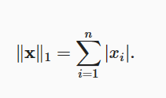

[toc]
## 数据操作
张量(tensor)
无论哪个深度学习框架，它的张量类都和Numpy的ndarray相似，但深度学习框架中的张量类又比ndarray多一些重要的功能：支持GPU计算，支持自动微分。

张量是一个数组，这个数组可能有多个维度，有一个维度的张量对应数学中的向量，有两个维度的张量对应数学中的矩阵，<mark>而三个维度及以上没有特殊的数学名称</mark>。

### 运算符
在数据上执行运算时，对于数组来说，最简单且最有用的操作是<mark>按元素操作(elementwise)</mark>，将标准量运算符应用于数组中的每个元素。

接收n个输入，产生m个输出的函数用符号表示：
$f:R,R,……,R\to R,R,……,R$

常见的标准量运算符都可以被升级为按元素运算。
```python
x=torch.tensor([1.0,2,4,8])
y=torch.tensor([2,2,2,2])
# 常见的标准量运算符都可以升级为按元素运算
print(x+y)
print(x-y)
print(x/y)
print(x*y)
```
按元素运算可以应用更多的运算，比如求幂运算
```python
print(torch.exp(x))
```

除了按元素运算外，我们还可以执行线性代数运算，包括点积和矩阵乘法。

### 张量连结(concatenate)，可以将两个张量按指定维度连结在一起。

```python
x=torch.arange(12).reshape(3,4)
y=torch.tensor([[2,1,4,3],[5,6,4,8],[8,9,6,3]])
print(torch.cat((x,y),dim=0))
print(torch.cat((x,y),dim=1))
```
```python
tensor([[ 0,  1,  2,  3],
        [ 4,  5,  6,  7],
        [ 8,  9, 10, 11],
        [ 2,  1,  4,  3],
        [ 5,  6,  4,  8],
        [ 8,  9,  6,  3]])
tensor([[ 0,  1,  2,  3,  2,  1,  4,  3],
        [ 4,  5,  6,  7,  5,  6,  4,  8],
        [ 8,  9, 10, 11,  8,  9,  6,  3]])
```
按行连结就是按行堆叠起来，按列连结就是按列堆叠起来

### 通过逻辑运算符构建二元张量
两个张量若在一个位置元素相同，则为True，否则为False

```python
x==y
```
```python
tensor([[False,  True, False,  True],
        [False, False, False, False],
        [ True,  True, False, False]])
```
### 对张量中的元素求和
```python
x.sum()
```

### 广播机制
两个形状相同的张量进行操作是合理的，但是若形状不同的张量，在<mark>一些情况</mark>下，可以通过广播机制(broadcasting)来执行按元素操作。

它的工作方式：
- 1.通过适当的复制元素，使得两个张量具有相同的形状
- 2.对两个张量进行操作

### 索引与切片
与任何Python数组相同，第一个元素索引为0，最后一个元素索引为-1，切片为包含start，不包含end元素的数组。

格式为:
[维度1切片,维度2切片,……]
但不能跨维度，连续的维度一定要都写出来

切片不止可以取指定的元素，也可以为指定位置的元素赋值
```python
print(x)
print(x[-1])
print(x[1:3])
print(x[1,1])
print(x[1,1:3])
print(x[1,])
print(x[2,])

```
```python
tensor([[ 0,  1,  2,  3],
        [ 4,  5,  6,  7],
        [ 8,  9, 10, 11]])
tensor([ 8,  9, 10, 11])
tensor([[ 4,  5,  6,  7],
        [ 8,  9, 10, 11]])
tensor(5)
tensor([5, 6])
tensor([ 8,  9, 10, 11])
```
### 节省内存
运行一些操作可能会令导致为新结果分配新内存，而不是原地更新。

这回造成一些不方便:
- 1.在机器学习中，由于参数十分多，如果都是这样分配新内存，而不是原地更新，会导致造成内存的大量浪费。

- 2.而且其他引用仍然会指向旧的内存位置，某些代码可能会无意中引用旧的参数。

所以，如果某时刻变量的值不会被重复使用，那么我们可以利用切片表示法来进行原地操作:
```python
z=torch.zeros_like(x)
print(f"idz:{id(z)}")
z[:]=x+z
print(f"idz:{id(z)}")
```
```python
idz:2220999240824
idz:2220999240824
```
### 转换为其他python对象
将深度学习框架定义的张量转换为numpy张量(ndarray)很容易，反之也很容易。

<mark>torch与numpy共享底层内存，更改一个张量也会更改另一个张量。</mark>

```python
x=torch.arange(12).reshape(3,4)
A=x.numpy()
b=torch.from_numpy(A)
print(A)
print(b)
```
```python
[[ 0  1  2  3]
 [ 4  5  6  7]
 [ 8  9 10 11]]
tensor([[ 0,  1,  2,  3],
        [ 4,  5,  6,  7],
        [ 8,  9, 10, 11]])
```
```python
A += 500
print("A",A)
print("b",b)
print("x",x)
```
```python
A [[500 501 502 503]
 [504 505 506 507]
 [508 509 510 511]]
b tensor([[500, 501, 502, 503],
        [504, 505, 506, 507],
        [508, 509, 510, 511]])
x tensor([[500, 501, 502, 503],
        [504, 505, 506, 507],
        [508, 509, 510, 511]])
```
### 将张量转换为Python标量
```python
a=torch.tensor([3.5])
a.item()
float(a)
int(a)
```
```python
a = torch.tensor([3.5])
print(a.shape)
b = torch.tensor(3.5)
print(b.shape)
```
区分torch.tensor([3.5])和torch.tensor(3.5)
```python
torch.Size([1])
torch.Size([])
<class 'torch.Tensor'>
```

## 数据预处理
在解决实际问题时，我们经常从预处理原始数据开始，而非那些准备好的张量格式数据。pandas可以和张量兼容。

### 读取数据集
```python
pd.read_csv(path)
```
### 处理缺失值
"NaN"代表缺失值，为了处理缺失的数据，典型的方法包括：
- 插值法:用一个替代值弥补缺失值
- 删除法:直接忽略缺失值。

使用一列的均值来代替该列的缺失值
```python
inputs, outputs = data.iloc[:, 0:2], data.iloc[:, 2]
inputs = inputs.fillna(inputs.mean())
print(inputs)
```
对于类别值或者离散值，我们将"NaN"视为一个类别。
```python 
inputs = pd.get_dummies(inputs, dummy_na=True)
print(inputs)
```
```python
   NumRooms  Alley_Pave  Alley_nan
0       3.0           1          0
1       2.0           0          1
2       4.0           0          1
3       3.0           0          1
```

### 转换为张量格式
现在inputs和outputs中的所有条目都是数值类型，可以转换为张量格式。
```python
x,y=torch.tensor(inputs.values),torch.tensor(outputs.values)
x,y
```

## 线性代数
### 标量
仅包含一个数值被称为**标量(scalar)**

本书中标量变量由普通小写字母表示，本书用$R$表示所有连续实数标量的空间。

标量的实例化:tensor()内直接传入一个数值
```python
x=torch.tensor(3.5)
```

### 向量
<mark>可以被视为标量值组成的列表</mark>，这些标量值被称为向量的元素(element)或分量。

向量通常记为粗体、小写的符号

通过一维张量表示向量，一般来说，张量可以具有任意长度，取决于机器的内存限制。

我们一般认为列向量是默认的方向。
$\bold{x}=\left[\begin{matrix} x_1\\x_2\\…\\x_n\end{matrix}\right]$

### 长度、维度与形状
向量的长度常称为向量的维度(dimension)

获取向量的维度
```python
len(x)
```
张量表示一个向量时，可以通过.shape属性访问向量的长度
```python
x.shape
```
返回向量的长度/维数
```python
torch.size([4])
```
<mark>值得注意的是，张量的维度指的是张量的轴数，向量的维度指的是向量的长度，张量某个轴的维数指的是这个轴的长度</mark>。

### 矩阵
向量将标量从零阶推广到一阶，矩阵将向量从一阶推广到二阶。

当矩阵的长宽相同时，被称为方阵(square matrix)

矩阵的转置:
```python
A.T
```
对称矩阵的转置与它本身相同

### 张量
张量(这里指代数对象)是描述具有任意数量轴的n维数组的通用方法，例如:向量是一阶张量，矩阵是二阶张量。

开始处理图像时，张量就变得更加重要，图像以n维数组形式出现，三个轴对应高度、宽度、通道(channel)轴。

### 张量算法的基本性质
任何按元素的运算都不会改变张量的形状

```python
A = torch.arange(20, dtype=torch.float32).reshape(5, 4)
B = A.clone()  # 通过分配新内存，将A的一个副本分配给B
A, A + B
```
```python
(tensor([[ 0.,  1.,  2.,  3.],
         [ 4.,  5.,  6.,  7.],
         [ 8.,  9., 10., 11.],
         [12., 13., 14., 15.],
         [16., 17., 18., 19.]]),
 tensor([[ 0.,  2.,  4.,  6.],
         [ 8., 10., 12., 14.],
         [16., 18., 20., 22.],
         [24., 26., 28., 30.],
         [32., 34., 36., 38.]]))
```

两个矩阵的按元素乘法称为Hadamard积,符号为$\bigodot	
$


```python
A*B
```
张量乘以或加上一个标量不会改变张量的形状，其中每个张量的每个元素都将与标量相加或相乘

### 降维
可以对任意张量进行元素和的计算。

各维度元素之和
```python
x.sum()
```
按行进行求和
```python
x.sum(axis=0)
```
按列进行求和
```python
x.sum(axis=1)
```
沿着行和列对矩阵求和，等价于对矩阵的所有元素进行求和
```python
x.sum(axis=[0,1])
```
求平均值:
```python
x.mean(axiis=0)
x.sum(axis=0)/a.shape[0]
```
### 非降维求和
在求和时，可以保持张量的轴数不变(每个轴的长度可以变)
```python
sum_A=A.sum(axis=0,keepdims=True)
```
由于sum_A在对每行进行求和后仍保持两个轴，可以通过广播将A除以sum_A
```python
A/sum_A
```
计算累积和，按行按列都可以，这里以按行为例
```python
A.cumsum(axis=0)
```
### 点积(Dot Product)
给定两个相同长度的向量$x,y$,它们的点积$x^Ty$表示相同位置的按元素乘积的和:$x^Ty=\sum^d_{i=1}x_iy_i$
```python
torch.dot(x,y)
```
我们也可以按照按元素乘法，然后进行求和来表示两个向量的点积,这一步其实就是相当于将求点积的两个步骤分开执行，先相乘然后相加。
```python
torch.sum(x*y)
```
### 矩阵-向量积
其实就是相当于由多个与列向量x相同长度的。


在代码中使用张量表示矩阵-张量积，使用mv函数，A的列维数与x的维数相同。
```python
torch.mv(A,x)
```
### 矩阵-矩阵乘法
可以将矩阵-矩阵乘法看作m次矩阵-向量乘法，并将这些结果拼接在一起。


```python
B=torch.ones(4,3)
A=torch.ones(5,4)
C=torch.mm(A,B)
print(C)
```
```python
tensor([[4., 4., 4.],
        [4., 4., 4.],
        [4., 4., 4.],
        [4., 4., 4.],
        [4., 4., 4.]])
```
矩阵乘法和"Hadamard积"不同，不可混淆。

### 范数

向量的范数表示一个向量有多大，这里考虑的大小(size)不涉及维度，而是分量的大小。

在线性代数中，向量范数是将向量映射到标量的函数f，给定任意向量x，向量范数满足的性质:
-  第一个性质是：如果我们按常数因子$\alpha$缩放向量的所有元素， 其范数也会按相同常数因子的绝对值缩放:
    $f(\alpha x)=|\alpha|f(x)$
- 第二个性质是熟悉的三角不等式:
    $f(x+y)\leq f(x)+f(y)$
- 第三个性质是范数非负:
    $f(x)\geq 0$

$L_2$范数：

```python
a=torch.tensor([3,4])
torch.norm(a)
```
$L_1$范数：

```python
torch.abs(a).sum()
```


**矩阵的范数**
类似于向量的范数，矩阵的Forbenius范数是矩阵元素平方和的平方根:

```python
torch.norm(torch.ones((4, 9)))
```
### 范数和目标
用向量表示物品，以便最小化相似项目之间的距离，最大化不同项目之间的距离。

目标，通常被表示为范数的相关形式。

## 微积分
用内接多边形逼近圆的方法 称为逼近法，这是积分(integral calculus)的起源。

微积分的另一支，微分(differential calculus)在两千多年后被发明。

在深度学习中，训练模型，不断更新它们，使它们在看到越来越多数据时变得越来越好，变得更好意味着最小化一个损失函数。
但训练模型只能使得模型与我们实际能看到的数据相拟合。

因此，我们可以将拟合模型分解为两个关键问题:
- 优化(optimization)：用模型拟合观测数据的过程
- 泛化(generalization)：生成出有效性超出用于训练的数据集本身的模型

### 导数和微分
假设我们有一个函数$f:R\to R$，其输入和输出都是标量。 如果$f$的导数存在，这个极限被定义为$f'(x)=lim_{h\to 0}\frac{f(x+h)-f(x)}{h}$

如果$f'(a)$存在，则f在a处是可微的(differentiable),如果f在一个区间内都是可微的，那么这个函数在这个区间中都是可微的。$f'(x)$可以解释为$f(x)$相对于x的瞬时变化率。

以下表达式是等价的:


导数运算法则：


### 偏导数
深度学习中，遇到的总是多元函数，偏导数的计算可以表示为:


### 梯度
自变量为$x=[x_1,x_2,……,x_n]^T$
函数$f(x)$相对于$x$的梯度为:
$\nabla f(x)=[\frac{\partial f(x)}{\partial x_1},\frac{\partial f(x)}{\partial x_2},……,\frac{\partial f(x)}{\partial x_n}]^T$

其中，$\nabla _xf(x)$没有歧义时可以被$\nabla f(x)$代替。


### 链式法则
在深度学习中，多元函数通常是复合的，这时就需要链式法则来计算导数。
对于单变量函数，就是复合函数求导：


而对于多变量函数来说：
对于每一个中间变量都是$x_1,x_2……x_n$的函数来说，其实就是相当于神经网络第二个隐藏层以后的输入都是对于前一层的输入进行中间处理的结果：


### 自动微分
对于复杂的模型，手工进行求导是一件很痛苦的事且容易出错，深度学习框架中通过自动计算导数，即自动微分来加快求导。

根据设计好的模型，系统会构建一个<mark>计算图(computational graph)</mark>,来跟踪计算哪些数据通过哪些组合来产生输出。

<mark>反向传播(backpropagate)</mark>意味着跟踪整个计算图填充关于每个参数的偏导数。

