feedward netword(前馈神经网络)与RNN的区别:

智慧客服等场景下，系统需要理解一句话中的意思就需要进行槽位填充(slot filling)。将一句话中对应的词语填充到对应的槽位，比如说将台北填充到destination槽位。
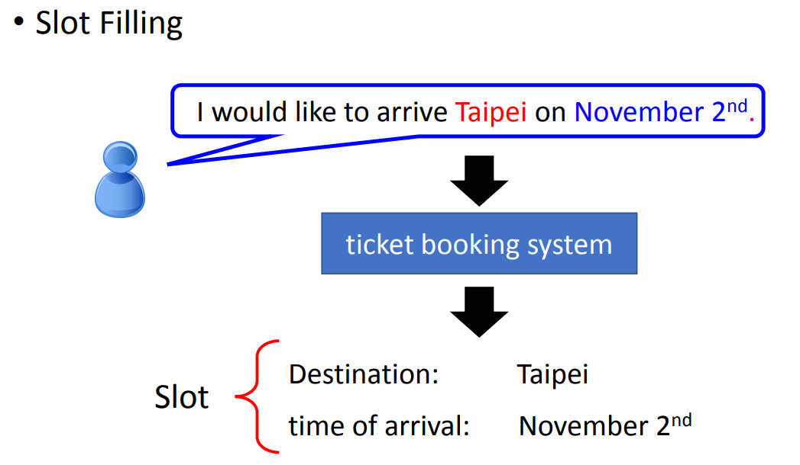
slot filling可以如何解决呢？可以用一个feedward neural network来解。

但是一个词汇要丢到一个nn中的话就需要用向量来表示。

最简单的方法就是1-of-N Encoding。
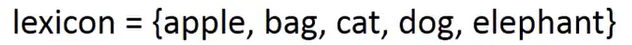
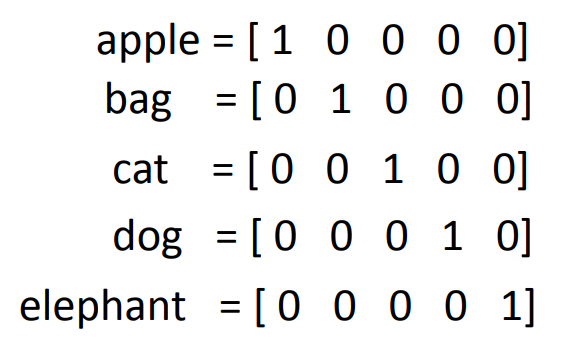
也就是用0与1表示有没有这个东西。

如果出现了从未见过的词汇，就将它归类到other当中。

还有一种word hashing的方法，将26个英文字母三个排列组合，如果一个单词中有其中的组成部分，那么就可以利用这些组成部分唯一标识单词。
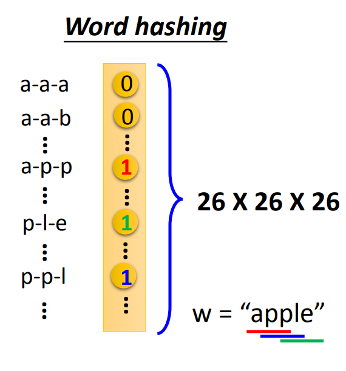

之后模型会得到一个概率分布，得到input属于哪个槽位的概率。

但是这样子并不能解决，因为同样的一个输入在不同的语境之下可能会扮演不同的属性，而同一个输入对于神经网络来说输出的变化应该是不大的，比如说输入Taipei后输出的结果比较稳定。
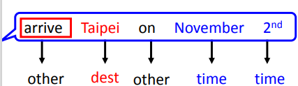
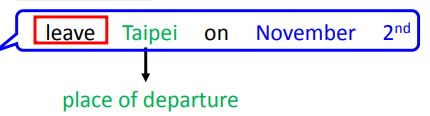

那么要想在不同的语境下得到想要的结果，就<mark>应该语境考虑进来</mark>，也就是让神经网络拥有记忆。

这种有记忆的neural network就应该是Recurrent Neural Network(RNN)。

这种记忆该怎么产生呢？可以<mark>在hidden layer</mark>将每次的输出存起来，并将这个输出作为这个神经元下一次迭代时的输入的一部分。
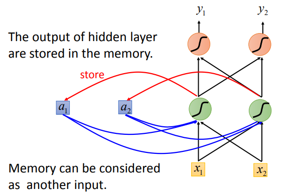

并且输入的顺序也会对结果有所影响，因为每一次的输出都依赖于前几次的输出。

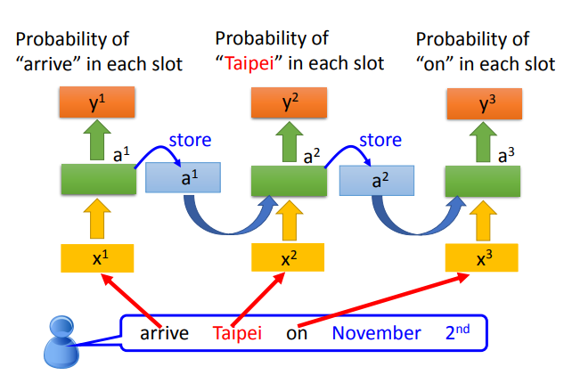
上图展示的是单隐层的RNN，值得注意的是，这是一个RNN而不是三个RNN。该图表达的含义是：一句话"arrive Taipei on November 2"将每个单词作为向量传入神经网络，但是它们的输入是前一个单词产生输出后，后一个单词和前一个单词在隐层的输出一起作为新的输入。所以上图其实是三个不同时间但是是同一个神经网络。

当然，RNN也可以叠加很多层，在每个隐层将该层的输出存起来，在下一个时间点再作为该隐层的输入。
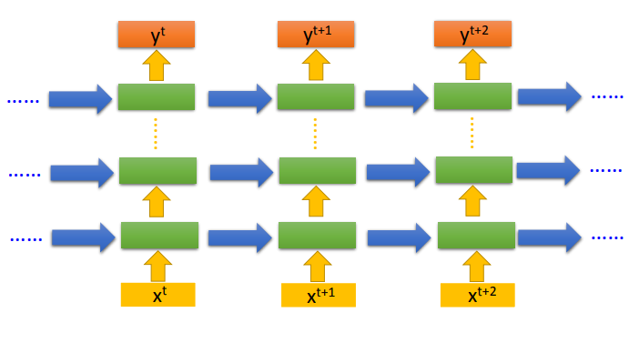

<mark>上述的RNN是RNN的一种，称为Elman Network</mark>。

还有Jordan Network:
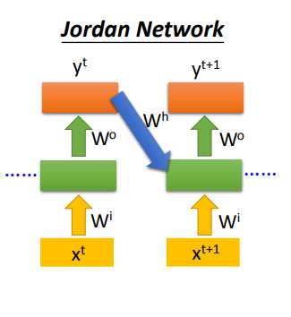

这是将整个模型的输出作为隐层的输入

RNN也可以是双向(Bidirectional RNN)，同时设置两个神经网络，一个将句子从前往后读入，另一个将句子从后往前读入，分别被隐层处理后，传给同一个输出层。<mark>这样的好处是在处理一个单词时，确定它的slot时将整个句子都作为了依据，而不只是句子的前一半后一半。</mark>
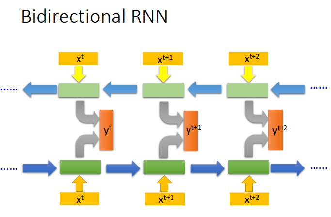

上述的RNN只是RNN最simple的一个版本，上述的memory也只是一个最simple的memory，可以随时读随时取。

而现在常用的memory是Long Short-term Memory(LSTM)。

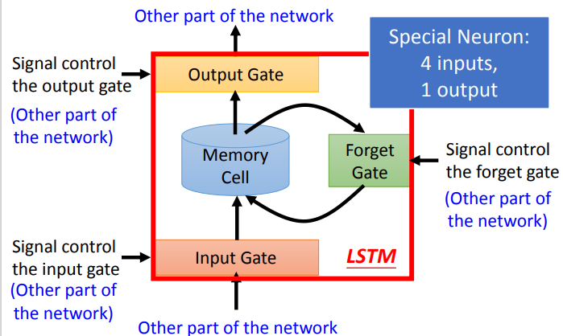
LSTM有三个gate(门):
- input gate
    决定要不要让输入成功输入到memory cell
- output gate
    决定要不要让输出真正输出
- Forget gate
    决定要不要遗忘之前的记忆

LSTM仍旧是短期的记忆，但可以让这个记忆变得长一点
  
有四个输入:
- 第一个是想要存到cell中的input
- 第二个操控输出门的信号
- 第三个是操控输入门的信号
- 第四个是操控遗忘门的信号

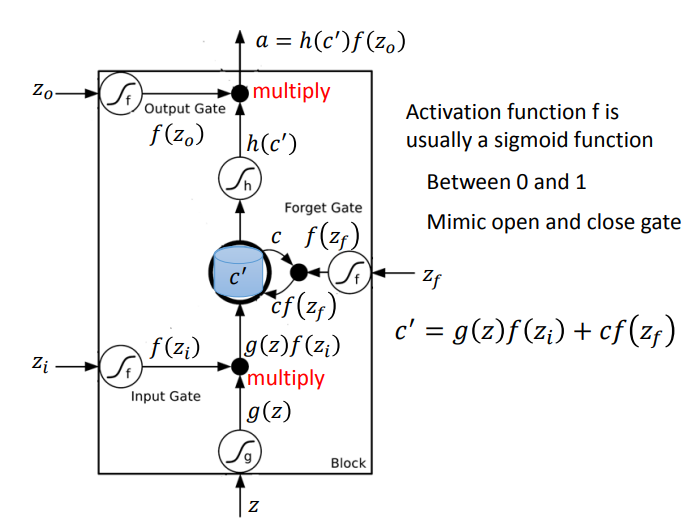
上图展示的就是LSTM的记忆单元的存取流程，在这里，<mark>输入门、输出门、遗忘门的激活函数都是sigmoid函数，这样它们的输出就是0~1或者说就是0和1，0就意味着关门，1就意味着开门</mark>。对于一个input它在经过激活函数处理后，和输入门的输出相乘，若输入门输出为1那么就输入成功，否则输入失败。然后之前的记忆传入遗忘门，若遗忘门关门，那么就会遗忘之前的记忆，否则留下。这个门的开关和常理是反着的，更应该称为是记忆门。然后，如果输出门输出为1的话，就成功输出了。

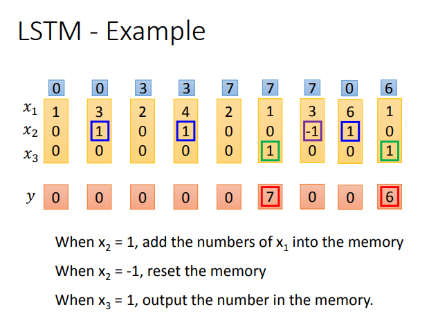
这里输入的vector的作用是这样的，$x_2$为1时输入门打开，$x_2$为-1时重置，$x_3$为1时输出门打开。

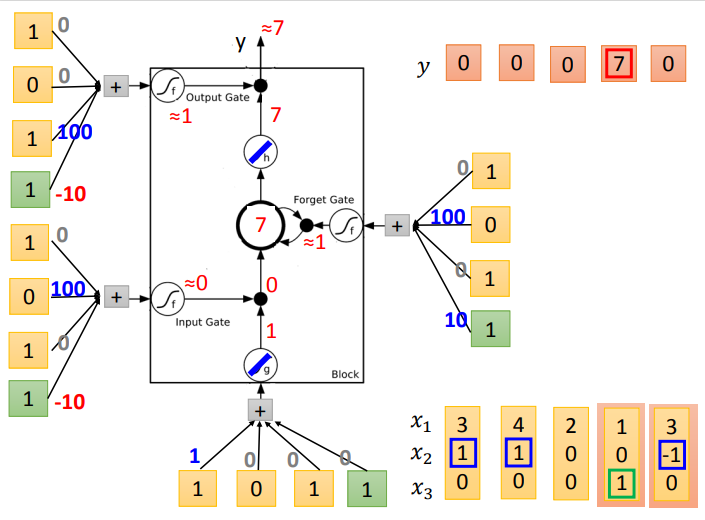

每次输入的向量会和一个bias共同充当四个输入。

其实一个LSTM的单元就是一个神经元，只是这个神经元存在四个输入而非一个输入。所以一个神经元个数相同的LSTM network和一般的神经网络相比，参数量是它的四倍。

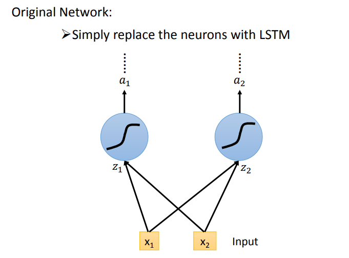

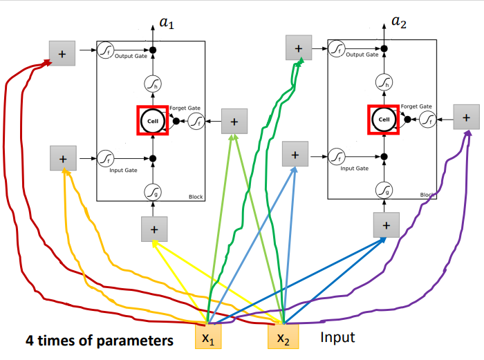

上图中的权重可以转换为矩阵，变为下图的形式，更贴近实际情况，对于输入的向量，通过四个矩阵的转换，分别作为四个输入输入LSTM 单元
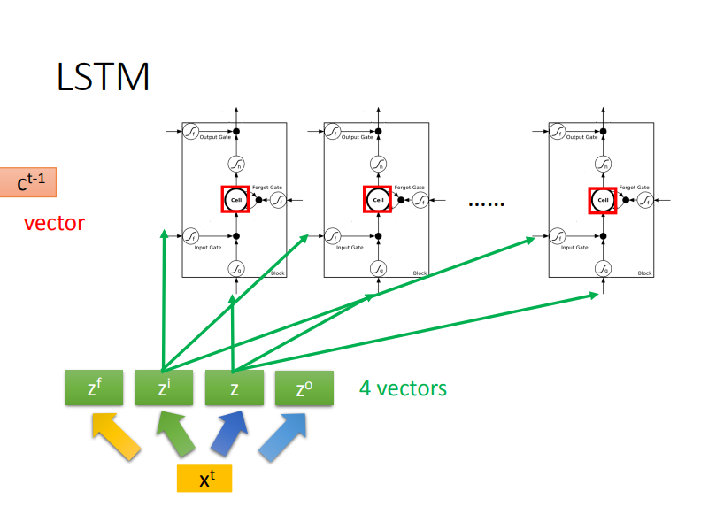

值得一提的是，这里的向量是n维的，每一维对应一个LSTM的对应门的输入
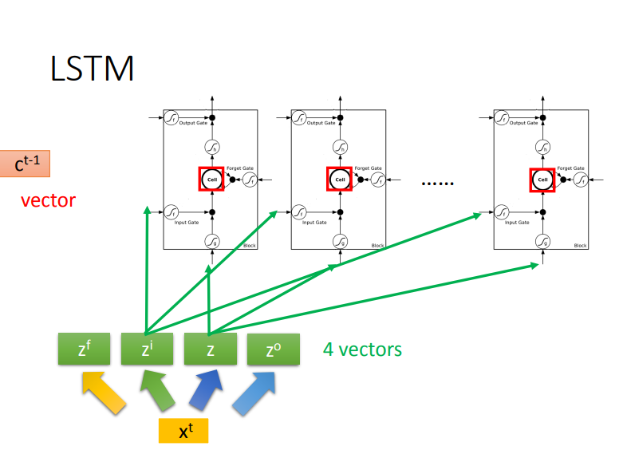

下图是一个LSTM cell中的运算流程
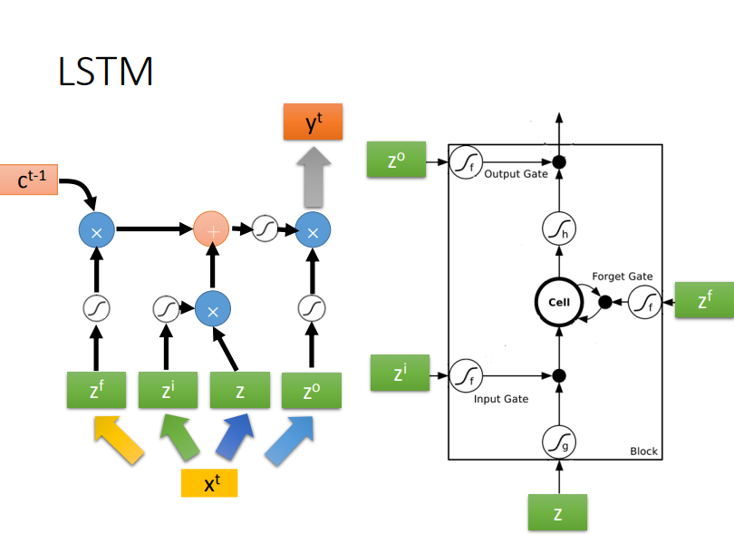

其实对于一个LSTM来说，还有两个部分，如下图所示，$h$和$c$,隐层的输出和memory还会作为输入。
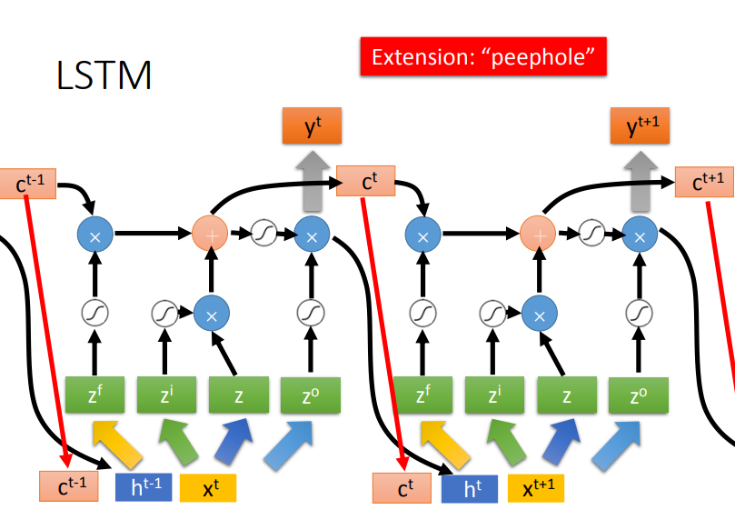

LSTM而且还会有多层
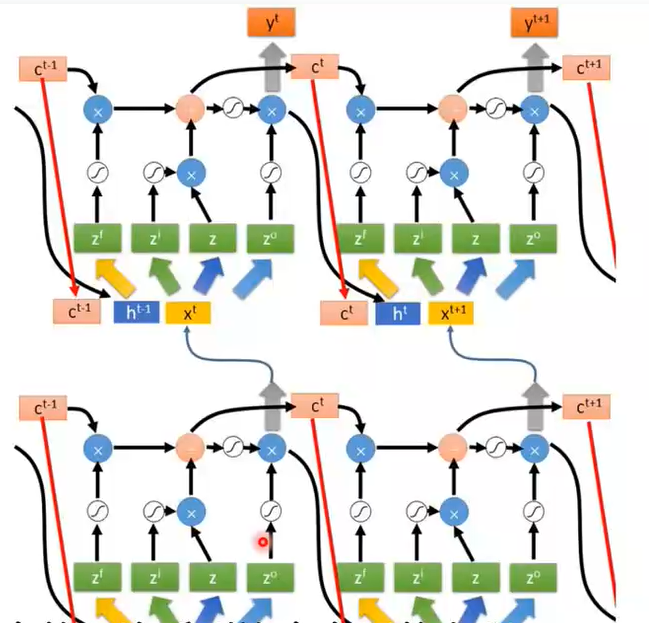