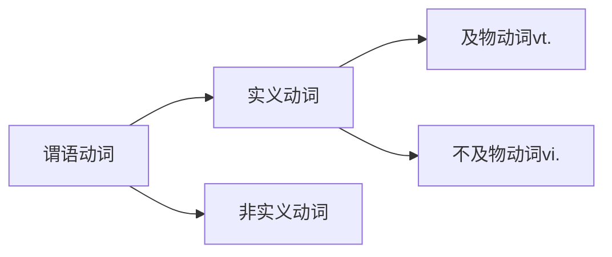

## 简单句

核心即为名词+动词


==及物动词Vt.与不及物动词Vi.最大的区别在于这个动作能否由主语独立完成==

根据谓语动词的不同分类，简单句可分为：

及物动词与不及物动词的区别就是动词后面可否加物

### 主谓=主语+不及物动词Vi.

==主语一个对象就可完成这个动作，不需要再介入其他对象==

### 主谓宾=主语+及物动词Vt.+宾语

### 主谓双宾=主语+及物动词Vt.+两个宾语（通俗理解为人和物）

一般为两种写法：

* ==vt.+人+物==

- ==vt.+物+介词+人==

不论哪种写法，==人都是间接主语，物都是直接主语==，都是==动词作用于物==，然后==传递给人==

### 主谓宾补=主语+vt.+宾语+宾语补足语

宾语补足语是==对动词宾语组成的意思进行一个补充，这个补充并不是一个物，而是一种语义上的完整，更像是一种对宾语的形容==

### 主系表=主语+系动词+表语

系动词就是在没有实义动词但是==句子结构需要所加的一部分==

| 系动词                      | 含义      |
| --------------------------- | --------- |
| be                          | 是        |
| get/turn/go/become/grow     | 变得      |
| look/sound/smell/taste/feel | 感觉      |
| seem/appear                 | 似乎/仍然 |
| keep/remain/                | 仍然      |
| prove                       | 显示出    |

==只有这些动词为这些意思时才是系动词。==

## 简单句的核心变化

主语+谓语动词

# 动词的==时态、情态、语态、否定==

## 时态
==时态是每个动词都有的：==

$四种时间：过去、现在、未来、过去将来\\四种状态：一般、进行、完成、完成进行\\四种时间 \times 四种状态=十六种时态$

### 一般时态：不特殊，不进行强调进行也不强调完成，只是表达事情发生在这个时间段内

**一般过去时**：谓语动词=动词过去式did
表示现在经常性、习惯性发生的事

**一般现在时**：谓语动词=动词原形或第三人称do/does
通常表示完全发生在过去的事

**一般将来时**：谓语动词=will do或am/is/are going to do
表示发生在将来的事，即现在的之后

**一般过去将来时**：谓语动词=would do 或was/were going to do
表示过去的之后

==一般将来时与一般过去将来时，都是站在一个时间点看将来，只是一个是站在过去看，一个是站在现在看==
### 进行时态：强调在某个时间段正在进行或者持续进行某事

**过去进行时**：谓语动词=was/were doing

**现在进行时**：谓语动词=am/is/are doing

**将来进行时**：谓语动词=will be doing
### 完成时态：
完成不代表都做完了，它包含了两方面的含义：一是"全部完成"，二是"部分完成"，==完成时态表达的是一件事的完成结果，无论做完与否都是表达一个完成的结果==。==完成时态的重点是看事情的角度==：要==站在一个时间点回头看之前==，才知道事情完成得怎么样

**过去完成时**:谓语动词=had + done
表示站在过去看之前发生的一件事的完成结果
使用过去完成时，要满足==两大要素——"过去"和"之前"==，当然"过去"并不一定要出现before这类的明示，隐含意义也可以。
过去完成时与一般过去时相比起来，==过去完成时要比一般过去时先发生==。
过去完成时表达的其实是一个时段，即==从"过去的之前"到"过去" 这段时间==

**现在完成时**表示站在现在看之前的一件事的完成结果
在has和done之间经常加一些副词，诸如:already、just、ever等
==现在完成时的全部完成可以和一般过去时对换==，但是强调的点不同
==现在完成时的部分完成不可以和一般过去时对换==，因为事情一直持续到现在还没有做完，还在做，这样就不算完全发生在过去的事了

### 完成进行时态
就是完成和进行两种时态的结合，即在完成时态的基础上更进一步强调了进行的过程。所以完成进行时态的用法为：==某时间之前，强调一件事进行的过程。==

**现在完成进行时**:谓语动词=have/has been doing
与现在完成时看事情的角度相同，只是强调的方面不同

**过去完成进行时**:谓语动词=had been doing

**将来完成进行时**:谓语动词=will have been doing

==注意：不管表达时态的谓语动词有几个，都算作一个整体，即一个谓语动词==

|          | 过去           | 现在           | 将来           | 过去将来       |
| -------- | -------------- | -------------- | -------------- | -------------- |
| 一般     | 一般过去时     | 一般现在时     | 一般将来时     | 一般过去将来时 |
| 进行     | 过去进行时     | 现在进行时     | 将来进行时     | -              |
| 完成     | 过去完成时     | 现在完成时     | 将来完成时     | -              |
| 完成进行 | 过去完成进行时 | 现在完成进行时 | 将来完成进行时 | -              |

## 情态
情态就是"==情绪和态度==",针对不同的事情要表达不同的情绪和态度，所以要在谓语动词前加上不同的情态动词。情态的变化是保持谓语动词不变，在动词原形前加一个情态动词。

常出现的情态动词如下:
| 现在时 | 过去时 |
| ------ | ------ |
| must   | -      |
| can    | could  |
| will   | would  |
| shall  | should |
| may    | might  |
### 情态动词使用的特点:
- 情态动词后加动词原形
- 情态动词一般只有现在和过去两种时态，上表中只有must没有过去时
- ==要注意的是==，could/might/should/would除了表示相应的过去时之外，还可以表示现在时的一种更加委婉的语气
- 情态动词没有第三人称单数
- 变否定时，直接在情态动词之后加not，变疑问，直接把情态动词提到主语之前
### 情态动词表示"情态"
| 情态动词   | 含义                              |
| ---------- | --------------------------------- |
| must       | 必须                              |
| can/could  | 能够/可以                         |
| will/would | 愿意/将要(表示将要时常用与将来时) |
| may/might  | 可以/可能                         |
| should     | 应该                              |

### 情态动词表示"推测"
除了表示"情绪和态度外"，每一个情态动词都可以表示推测,其中推测可能性最高的是must,推测可能性最低的是can't/couldn't表示不可能,其他表示推测的，可以理解为"可能，也许"

情态动词+have done 表示对之前的事情表达情态或者推测
情态动词+be doing 表示对正在进行的事情表达情态或者推测

常见的情态动词词组:ought to、have to

==情态动词+动词原形==算作一个整体，即一个谓语动词

### 谓语动词表示"语态"
语态分为两种:
主动语态，主语是谓语动词的发出者

被动语态:主语是谓语动词的承受者

主动语态并没有专门的形式，只要谓语动词不是被动的形式，就是主动的形式

#### 被动语态的构成:be+done
想要确定被动动态只需要三个步骤：
1.确定被动的动作，变为过去分词done
2.确定被动的时间，把be变成相对应的时态
3.根据主语，确定be动词的单复数

被动语态翻译时有时不会翻译出"被"这个字

#### 被动语态与时态的结合
表示被动的动作发生在不同的时间内，需要把被动语态与时态相结合，将be变成对应的各种时态

#### 被动语态与情态的结合
表示被动的动作与"猜测"相结合
情态动词+be done

==无论是被动语态和情态还是时态结合，都是一个完整的谓语动词==

## 谓语动词的否定
简单句中表示否定，要把谓语动词变成对应的否定形式，主要分为两种:实义动词变否定，助动词与情态动词变否定
- 1.实义动词变否定
前加助动词do/does/did，再加上not，最后加动词原形

- 2.情态动词变否定
助动词与情态动词变否定直接加not，例如:be动词、情态动词、完成时态中的have等
==如果一个句子中包含多个助动词或者情态动词，否定加在第一个后==
## 谓语动词的强调
要想强调谓语动词部分，==可直接在前面加上do/does/did==，然后==把谓语动词变成原形==

总结:
- 谓语动词的三态一否不管怎么变，都是一个完整的整体
- 抓住谓语动词，就抓住了句子最核心的表述动作或内容
- 通过定位谓语动词，找到复杂多变的主语
- 通过谓语动词的数量，判断长难句中包含了几件事

## 主语、宾语、表语的变化
$主语/宾语/表语的变化\stackrel{通常由名词或者相当于名词的成分充当}\rightarrow\begin{cases}1.名词、代词\\2.非谓语动词doing\\3.非谓语动词to do\\4.并列多个\end{cases}$

### (一)名词、代词
最常见的是名词或者名词词组来作主语、宾语、表语，其次是代词来代替上下文中提过的名词
### (二)非谓语动词doing
非谓语动词就是"不做谓语的动词",一共有三种形式:to do、doing、done，==其中，只有to do 与doing可以当作名词来用==
### doing作主语
- doing作主语，谓语动词用单数，如果多个doing并列，用复数。
==doing作主语时，需要额外注意的是及物动词后可能会接宾语，或者会有一些副词修饰，它们是一个整体==
### doing作宾语
宾语成分一般有两种位置，动宾与介宾，doing也是如此
### (三)非谓语动词to do
### to do 作主语
- 和doing意思差别不大，可以互换
- 位置有两种，如果较短则放于句首，如果较长，则放于句尾，句首用形式主语it来占位置
- 有多个to do并列时，用复数
- 主系表结构中，主语和表语都可以用非谓语动词，但是==如果同时使用时主语与表语的形式要保持一致==
### to do 作宾语
- 只能位于及物动词后，不能位于介词后
- to do 作宾语时，也可以后置，形式宾语也用it，但后置的条件除了比较长以外，还需要是在主谓宾补的句型中

### to do作表语
位于系动词后，通常是位于be动词后

### 并列多个
通常简单句中的主语、宾语、表语都是一个对象，即一个名词或代词等。

如果要表述多个对象，可以将多个名词、代词、doing、to do并列在一起，通常会在中间加上并列连词或者词组。

==表语中不仅可以由名词或者相当于名词的部分充当，也可以由形容词或者介词短语来充当==

如果表达的意思不同，并列连词就不能省略了
1.表示并列:顺接
| 并列连词(或词组)   | 表达含义     |
| ------------------ | ------------ |
| ……and……            | ……和……       |
| both……and          | ……和……       |
| not only……but also | 不但……而且…… |
2.表示选择
| 并列连词(或词组) | 表达含义     |
| ---------------- | ------------ |
| ……or……           | ……或……       |
| either……or……     | ……或者……     |
| neither……nor……   | 既不……也不…… |


## 简单句的扩展

### 词性角度的扩展
限定词：名词前常用限定词来充当，限定词包括冠词、数词、名词所有格等。

形容词、副词

```mermaid
graph LR
形容词-->作定语-->修饰名词，位于名词前后;
形容词-->作表语-->补充说明主语，位于系动词后;
副词-->修饰-->动词;
副词-->修饰-->句子;
副词-->修饰-->形容词或者其他副词;
```
形容词或者副词的三种比较级:
1.原级比较
2.比较级
3.最高级
