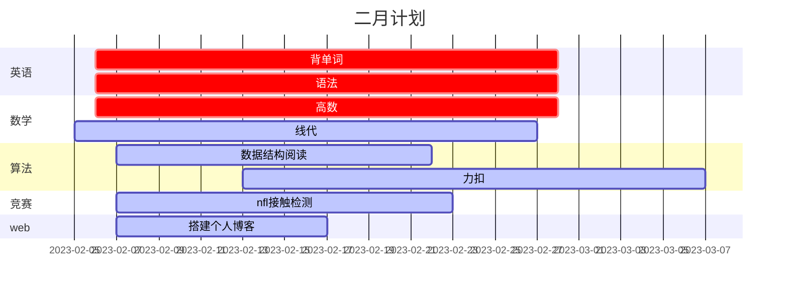

### 二月计划
| task                 | 开始时间                | 结束时间                                                               | 每日花费                                                                                     | 目标                                                   |
| -------------------- | ----------------------- | ---------------------------------------------------------------------- | -------------------------------------------------------------------------------------------- | ------------------------------------------------------ |
| 背单词               | 2.5                     | 2.28                                                                   | 50min单词书记忆+15min默写+20minAPP复习                                                       | 按部就班完成即可                                       |
| 语法学习             | 2.7                     | 2.28                                                                   | 0.5h                                                                                         | 基本掌握语法基础知识                                   |
| 高数基础阶段         | 2.7                     | 2.28                                                                   | 预习/听课/复习(导图绘制)/作业+订正，每日完成三阶段，约3~4h                                   | 基础知识打牢                                           |
| mit线性代数          | 2.6                     | 2.28                                                                   | 听课1h+导图0.5h                                                                              | 构建正确的线性代数观                                   |
| 数字图像处理复习     | 2.15                    | 2.25                                                                   | 每日花费1~2h                                                                                 | 掌握考点                                               |
| kaggle项目解析       | 2.7                     | 2.23                                                                   | 2h左右                                                                                       | 跑通baseline，掌握baseline中知识，把课听完吸收，有排名 |
| 个人博客搭建         | 2.7                     | 2.14                                                                   | 1.5h                                                                                         | 搭建自己的网站                                         |
| 算法、数据结构打基础 | 2.7                     | 2.28                                                                   | 阅读《图解算法》0.5h、《算法进阶》、刷力扣40min与博客搭建间隔来                              | 初步掌握数据结构及常用算法，并且编程能力有所提高       |
| 篮球训练             | 2.1                     | 2.28                                                                   | 间隔两天，进行一次2.5h左右的场次，间隔的两天内可以有1h左右的训练时间，具体据当天学习进度确定 | 球感提升、防守能力提升                                 |
| brilliant            | kaggle结束后            |
| 复盘日               | 2.7日起每隔5天复盘一日  | 复盘日单词进行复盘，复习高数、线代导图、错题，博客与算法多给点时间学习 |                                                                                              |
| 休息日               | 2.6日起复盘日后休息一天 | 该日算法、博客、竞赛继续，考研内容可休息一天                           |                                                                                              |
合计每日花费约为：10h

