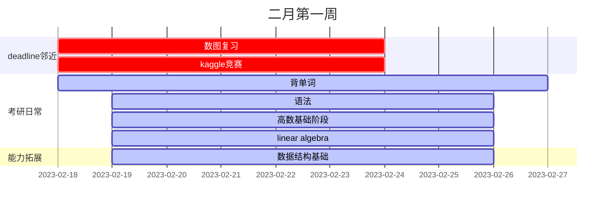

| task                 | start                                              | end                                                                    | expenture                                                                                                                              | target                                           |
| -------------------- | -------------------------------------------------- | ---------------------------------------------------------------------- | -------------------------------------------------------------------------------------------------------------------------------------- | ------------------------------------------------ |
| 考研作息             | 3.1                                                | endless                                                                | 每日7:20+-5min开始背单词,50min+-min之前完成默写并且按时打卡,晚上11:15之前睡觉,保持8小时睡眠,为了迎合学校上课时间,中午12:50应该上床睡觉 | 本周严格执行                                     |
| 高数基础阶段         | 3.1                                                | 3.5                                                                    | 预习/听课/复习(导图绘制)/作业+订正，每日完成3h~4h，分成两个2h进行                                                                      | 基础知识打牢                                     |
| 背单词               | 3.1                                                | 3.5                                                                    | 50min单词书记忆+15min默写+20minAPP复习                                                                                                 | 每天按部就班完成即可                             |
| mit线性代数          | 3.1                                                | 3.4                                                                    | 听课1h+导图0.5h，每日一次                                                                                                              | 构建正确的线性代数观                             |
| 语法学习             | 3.1                                                | 3.5                                                                    | 每日30min                                                                                                                              | 基本掌握语法基础知识                             |  |
| 算法、数据结构打基础 | 3.1                                                | 3.4                                                                    | 阅读《图解算法》30min每日                                                                                                              | 初步掌握数据结构及常用算法，并且编程能力有所提高 |
| 深度学习             | 3.1                                                | 3.5                                                                    | 每天听一~二节吴恩达，每日约30min                                                                                                       | 消化吸收生成导图                                 |
| 篮球训练             | 2.19                                               | 2.26                                                                   | 间隔两天，进行一次2h左右的场次                                                                                                         | 球感提升、防守能力提升                           |
| 复盘日               | 2.25日下午                                         | 复盘日单词进行复盘，复习高数、线代导图、错题，博客与算法多给点时间学习 |                                                                                                                                        |                                                  |
| 休息日               | 2.25日晚~2.26下午，2.26日晚继续新一轮              | 该日算法、博客、竞赛继续，考研内容可休息一天                           |                                                                                                                                        |                                                  |
| 作业                 | 随机                                               | 随机                                                                   | 作业及时做，匀到每天                                                                                                                   |
| 周末                 | 两道力扣题，github Hexo搭建，网站备案，B站字幕上传 |                                                                        |                                                                                                                                        |

