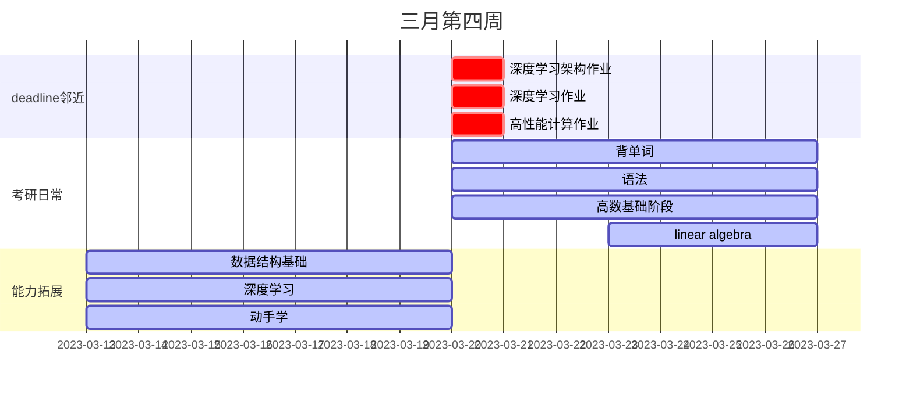

| task                 | start                                              | end                                                                    | expenture                                                                                       | target                                           |
| -------------------- | -------------------------------------------------- | ---------------------------------------------------------------------- | ----------------------------------------------------------------------------------------------- | ------------------------------------------------ |
| 考研作息             | 3.20                                               | endless                                                                | 恢复到6：50起床，周一周二午休必须进行，晚上23：15之前必须上床                                   | 本周严格执行                                     |
| 高数基础阶段         | 3.20                                               | 3.25                                                                   | 预习/听课/复习(导图绘制)/作业+订正，每日完成3h~4h，分成两个2h进，周一事情有点多，可以先少学一点 | 基础知识打牢                                     |
| 背单词               | 3.20                                               | 3.27                                                                   | 50min单词书记忆（分早晚）+15min默写                                                             | 每天按部就班完成即可                             |
| 语法学习             | 3.20                                               | 3.26                                                                   | 每日30min                                                                                       | 基本掌握语法基础知识                             |  |
| 算法、数据结构打基础 | 3.21                                               | 3.26                                                                   | 阅读《图解算法》30min每日，本周一可以先不学，因为周日时间比较多，算是先超前进行了               | 初步掌握数据结构及常用算法，并且编程能力有所提高 |
| 深度学习             | 3.20                                               | 3.26                                                                   | 每天听一~二节吴恩达，每日约30min                                                                | 消化吸收生成导图                                 |
| 动手学深度学习       | 3.20                                               | 3.26                                                                   | 及时完成任务，按时打卡                                                                          | 消化吸收生成导图                                 |
| mit线性代数          | 3.23                                               | 3.27                                                                   | 听课1h+导图0.5h，每日一次                                                                       | 构建正确的线性代数观                             |
| 复盘日               | 3.26日晚午                                         | 复盘日单词进行复盘，复习高数、线代导图、错题，博客与算法多给点时间学习 |                                                                                                 |                                                  |
| 休息日               | 3.27日早、3.26日下午，3.27日晚继续新一轮           | 该日算法、博客、竞赛继续，考研内容可休息一天                           |                                                                                                 |                                                  |
| 作业                 | 随机                                               | 随机                                                                   | 作业及时做，匀到每天                                                                            |
| 周末                 | 两道力扣题，github Hexo搭建，网站备案，B站字幕上传 |                                                                        |                                                                                                 |

