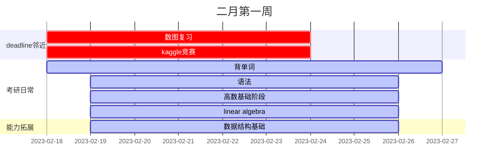

| task                 | start                                 | end                                                                    | expenture                                                                                                              | target                                           |
| -------------------- | ------------------------------------- | ---------------------------------------------------------------------- | ---------------------------------------------------------------------------------------------------------------------- | ------------------------------------------------ |
| 考研作息             | 2.18                                  | endless                                                                | 每日7:00开始背单词,8:00之前完成默写并且按时打卡,晚上10:50睡觉,保持8小时睡眠,为了迎合学校上课时间,中午12:50应该上床睡觉 | 本周严格执行                                     |
| 数字图像复习         | 2.18                                  | 2.23                                                                   | 除了考研内容及其他内容外，每日至少完成2章复习                                                                          | 完成所有ppt的复习并且达到一个较高的水准          |
| kaggleCV竞赛         | 2.18                                  | 2.23                                                                   | 除了考研内容与其他内容外其余时间全部于此                                                                               | 理解代码含义,跑通baseline,上传结果               |
| 背单词               | 2.18                                  | 2.23                                                                   | 50min单词书记忆+15min默写+20minAPP复习                                                                                 | 每天按部就班完成即可                             |
| 语法学习             | 2.19                                  | 2.25                                                                   | 20min                                                                                                                  | 基本掌握语法基础知识                             |
| 高数基础阶段         | 2.19                                  | 2.25                                                                   | 预习/听课/复习(导图绘制)/作业+订正，每日完成一阶段，约1.5h                                                             | 基础知识打牢                                     |
| mit线性代数          | 2.19、2.22                            | 2.25                                                                   | 听课1h+导图0.5h,在考试和kaggle结束前间隔两天一节                                                                       | 构建正确的线性代数观                             |
| 算法、数据结构打基础 | 2.19                                  | 2.26                                                                   | 阅读《图解算法》0.5h、2.20、2.21                                                                                       | 初步掌握数据结构及常用算法，并且编程能力有所提高 |
| 篮球训练             | 2.19                                  | 2.26                                                                   | 间隔两天，进行一次2h左右的场次                                                                                         | 球感提升、防守能力提升                           |
| 复盘日               | 2.25日下午                            | 复盘日单词进行复盘，复习高数、线代导图、错题，博客与算法多给点时间学习 |                                                                                                                        |                                                  |
| 休息日               | 2.25日晚~2.26下午，2.26日晚继续新一轮 | 该日算法、博客、竞赛继续，考研内容可休息一天                           |                                                                                                                        |                                                  |

